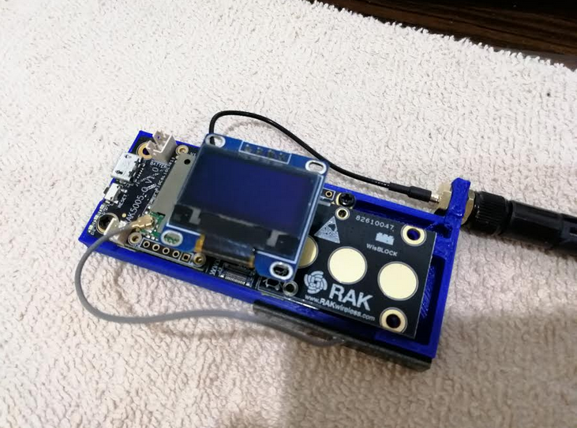

| 

  |  |
| -- | -- |

RAK14002 Capacitive Touch Button
========================================

| _**Based on [SparkFun Qwiic Capacitive Touch Slider - CAP1203](https://github.com/sparkfun/Qwiic_Capacitive_Touch_Slider_Arduino_Library).**_  |
| -- |    
| _**Changed to work with the CAP1293 touch pad chip.**_  |

[*RAKwireless RAK14002 Capacitive Touch Button*](https://docs.rakwireless.com/Product-Categories/WisBlock/#wisblock-io)

Arduino library for the I2C based capacitive touch pad module with 3 unique touch inputs. 

Repository Contents
------------------- 
* **/examples** - Example sketches for the library (.ino). Run these from the Arduino IDE.
* **/src** - Source files for the  library (.cpp, .h).

Documentation
--------------
* **[Product Repository](https://github.com/RAKWireless/RAK14002-CAP1293-Library)** - Product repository for the RAKWireless RAK14002 Capacitive Touch Pad.
* **[Documentation](https://docs.rakwireless.com/Product-Categories/WisBlock/#wisblock-io)** - Documentation and Quick Start Guide for the RAK14002 Capacitive Touch Pad.

Product Versions
----------------
* [RAKwireless RAK14002 Capacitive Touch Button](https://store.rakwireless.com/collections/wisblock-io) 

License Information    
-------------------

This library is based on [SparkFun Qwiic Capacitive Touch Slider - CAP1203](https://github.com/sparkfun/Qwiic_Capacitive_Touch_Slider_Arduino_Library) which is published under MIT license. See original license in the [Sparkfun repository](https://github.com/sparkfun/Qwiic_Capacitive_Touch_Slider_Arduino_Library)
